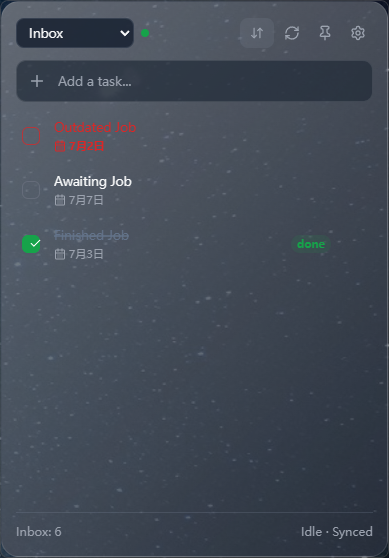
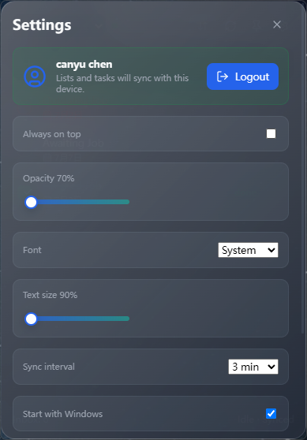
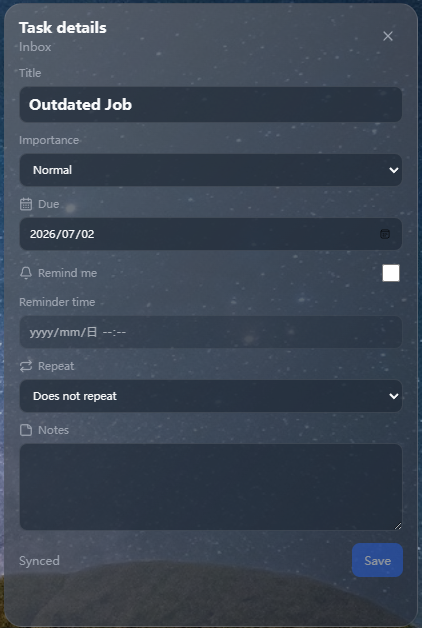

# Microsoft To Do Desktop Widget

A lightweight desktop widget for Microsoft To Do on Windows and macOS.

This project is not a full Microsoft To Do replacement. It is a small, frameless desktop surface for the tasks you want visible throughout the day, while Microsoft To Do remains the source of truth.

## Screenshots







## Features

- Frameless transparent desktop widget with right-click menu controls.
- Microsoft browser sign-in with Authorization Code + PKCE.
- Microsoft Graph sync for To Do lists and tasks.
- Remote list selector, including custom Microsoft To Do lists.
- Local SQLite cache with pending operation queue.
- Add, complete, edit, and sync tasks.
- Task details window with due date, reminder, repeat, importance, and notes.
- Task sorting by due date, importance, modified time, created time, reminder, and title.
- Optional completed-task display with distinct completed styling.
- Due-today and overdue task highlighting.
- Adjustable opacity, font family, text size, sync interval, and debug console.
- i18n support:
  - System language
  - English
  - Simplified Chinese
- Tray/menu-bar menu and quick-add shortcut:
  - Windows: `Ctrl + Alt + T`
  - macOS: `Cmd + Option + T`
- Native macOS WidgetKit extension scaffold for a compact Today/Main task widget.

## Tech Stack

- Tauri v2
- React
- TypeScript
- Vite
- Rust
- SQLite via `rusqlite`
- Microsoft Graph To Do API

## Download

Use the GitHub Releases page for prebuilt installers when available.

For source builds, follow the setup steps below.

## Azure App Registration

Microsoft sign-in requires an Azure App Registration. This app is a desktop public client, so do not create or use a client secret.

1. Open the Azure Portal.
2. Go to Microsoft Entra ID.
3. Create an App Registration.
4. Choose supported account types:
   - Use `consumers` for personal Microsoft accounts only.
   - Use `common` for both work/school and personal Microsoft accounts.
5. Add a redirect URI under **Mobile and desktop applications**:
   - `http://localhost`
   - The app uses a local loopback callback with a dynamic port.
   - If Azure shows a redirect mismatch, add the exact URI shown in the error.
6. Add delegated Microsoft Graph permissions:
   - `User.Read`
   - `Tasks.ReadWrite`
   - `offline_access`
7. Enable public client/native flows if your tenant requires it.

## Client ID Configuration

`MICROSOFT_CLIENT_ID` is not a secret, but source builds should normally use their own Azure App Registration.

For development:

```powershell
$env:MICROSOFT_CLIENT_ID = "your Azure app client id"
$env:MICROSOFT_TENANT = "consumers"
npm run tauri:dev
```

`MICROSOFT_TENANT` defaults to `consumers` when omitted.

You can also create a local `.env` file:

```env
MICROSOFT_CLIENT_ID=your Azure app client id
MICROSOFT_TENANT=consumers
```

Do not commit `.env`.

For installed builds, either bake the client ID in at build time or place a config file next to the executable/app bundle.

Build-time configuration:

```powershell
$env:MICROSOFT_CLIENT_ID = "your Azure app client id"
npm run tauri:build
```

Runtime config file:

```json
{
  "microsoft_client_id": "your Azure app client id",
  "microsoft_tenant": "consumers"
}
```

Use `ms-todo-desktop-widget.config.example.json` as the template.

## Development

Install dependencies:

```powershell
npm install
```

Run the Tauri app:

```powershell
npm run tauri:dev
```

Run the Vite-only frontend:

```powershell
npm run dev
```

## Build

Windows:

```powershell
npm run tauri:build
```

Or load `.env` automatically:

```powershell
.\scripts\build-tauri-with-env.ps1
```

macOS bundles must be built on macOS:

```bash
npm install
./scripts/build-tauri-with-env.sh
```

Or:

```bash
export MICROSOFT_CLIENT_ID="your Azure app client id"
npm run tauri:build:mac
```

To build the macOS app with the native WidgetKit extension embedded:

```bash
npm run tauri:build:mac:widget
```

This produces a signed app bundle with the widget extension at:

```text
src-tauri/target/release/bundle/macos/ms-todo-desktop-widget.app/Contents/PlugIns/TodoWidgetExtension.appex
```

and then creates a DMG under:

```text
src-tauri/target/release/bundle/dmg/
```

Build outputs are written under:

```text
src-tauri/target/release/bundle/
```

## macOS Native Widget

The Tauri app remains the full application. It handles Microsoft login, sync, settings, editing, and the detailed task window.

The native macOS WidgetKit extension lives in:

```text
macos-widget/
```

It is intentionally small: it reads a `todo-widget-snapshot.json` file from the shared App Group container and renders the Today/Main task list. It does not run the React UI and does not perform Microsoft sync itself.

The host app exports the snapshot to:

```text
~/Library/Group Containers/<APP_GROUP_ID>/todo-widget-snapshot.json
```

Before building the widget for a real Apple Developer account, replace the placeholder App Group:

```text
group.com.local.ms-todo-desktop-widget
```

with your real App Group ID in:

- `macos-widget/Sources/WidgetConfig.swift`
- `macos-widget/Entitlements/TodoWidgetExtension.entitlements`
- `macos-widget/Entitlements/HostApp.entitlements`
- `macos-widget/project.yml`
- `.env` or `ms-todo-desktop-widget.config.json` as `MACOS_APP_GROUP_ID` / `macos_app_group_id`

Build the WidgetKit extension on macOS:

```bash
./scripts/build-macos-widget-extension.sh
```

Build the full macOS package with the WidgetKit extension embedded:

```bash
npm run tauri:build:mac:widget
```

The script embeds the built extension into:

```text
ms-todo-desktop-widget.app/Contents/PlugIns/TodoWidgetExtension.appex
```

and signs both the host app and the extension with matching App Group entitlements.

Without `MACOS_SIGNING_IDENTITY`, the script uses ad-hoc signing for local experiments. This can produce a locally runnable `.app`, but it is not a proper distributable WidgetKit package. For a reliable installable release, use an Apple Developer certificate, a real App Group, and matching provisioning/signing settings:

```bash
export APPLE_DEVELOPMENT_TEAM="your team id"
export MACOS_SIGNING_IDENTITY="Developer ID Application: Your Name (TEAMID)"
export MACOS_APP_GROUP_ID="group.com.your-team.ms-todo-desktop-widget"
npm run tauri:build:mac:widget
```

## Data Storage

The SQLite cache is stored in the Tauri app data directory:

```text
ms-todo-desktop-widget/cache.sqlite3
```

The exact base directory depends on the operating system and Tauri's app data resolution.

Refresh tokens are stored with the OS credential store through the Rust `keyring` crate. Access tokens are requested by the Rust backend and are not exposed to React or browser local storage.

## Notes For Open Source Builds

- Do not commit `.env`, local database files, tokens, or user data.
- `MICROSOFT_CLIENT_ID` can be public, but using your own client ID for public releases means other builds may appear under your Azure app identity.
- Do not add a client secret. Desktop apps should use public client + PKCE.
- Keep Graph permissions minimal unless a feature requires more.

## Current Limitations

- Autostart is currently stored as a setting, but OS-level autostart wiring is still a follow-up.
- macOS packages must be built on macOS.
- This app focuses on a compact widget experience, not complete Microsoft To Do feature parity.

## License

Add a license before publishing the repository publicly.
